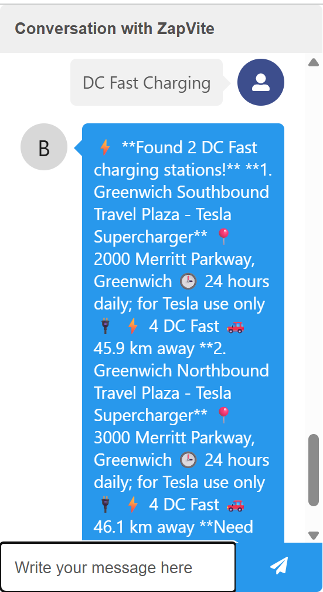
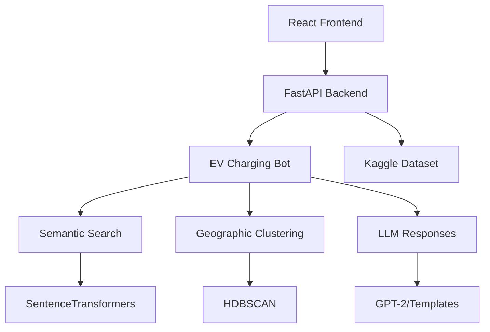

# ⚡ **ZapVite - AI-Powered EV Charging Station Assistant**

<div align="center">


*Intelligent conversational assistant for finding electric vehicle charging stations*

[🚀 Live Demo](#-demo) • [📖 Documentation](#-documentation) • [🛠️ Installation](#️-installation) • [🤝 Contributing](#-contributing)

</div>

---

## 🌟 **Overview**

**ZapVite** is an intelligent AI chatbot designed to revolutionize how EV drivers find and interact with charging stations. Using advanced natural language processing, semantic search, and geographic clustering, ZapVite provides personalized, context-aware assistance for all your electric vehicle charging needs.

### ✨ **Key Features**

🔍 **Intelligent Search**
- Semantic search using SentenceTransformers
- Geographic clustering with HDBSCAN
- Multi-criteria filtering (charging type, location, availability)

🤖 **Conversational AI**
- Natural language understanding
- Context-aware responses
- Multi-turn conversation support

📍 **Location Services**
- Proximity-based search
- Distance calculations
- Route optimization

⚡ **Charging Intelligence**
- DC Fast Charging (20-60 min)
- Level 2 Charging (2-8 hours)  
- Level 1 Charging (8-12 hours)
- 24/7 accessible stations

🎨 **User Experience**
- Beautiful, responsive React interface
- Real-time chat interactions
- Emoji-rich responses
- Mobile-optimized design

---

## 🛠️ **Tech Stack**

### **Frontend**
- **React 18+** - Modern UI framework
- **react-chatbot-kit** - Conversational interface
- **CSS3** - Responsive styling
- **JavaScript ES6+** - Modern syntax

### **Backend**
- **FastAPI** - High-performance async API
- **Python 3.8+** - Core language
- **Pandas** - Data manipulation
- **NumPy** - Numerical computing

### **AI/ML Stack**
- **SentenceTransformers** - Semantic embeddings
- **HDBSCAN** - Geographic clustering
- **scikit-learn** - ML utilities
- **Transformers** - LLM integration

### **Data Sources**
- **Kaggle Dataset** - Real EV charging station data
- **Geographic APIs** - Location services
- **Real-time availability** - Live station status

---

## 🚀 **Installation**

### **Prerequisites**
- Node.js 16+ and npm
- Python 3.8+
- Git

### **Quick Start**

```bash
# Clone the repository
git clone https://github.com/yourusername/zapvite.git
cd zapvite

# Install backend dependencies
pip install -r requirements.txt

# Start the backend server in EV-AI-Chatbot directory
python -m uvicorn Src.server:app --reload

# Open a new terminal, install frontend dependencies, and start the frontend in ev-chatbot-frontend directory
cd ev-chatbot-frontend
npm install
npm start
```
> **Note**: If you get a geolocation error, make sure to enable location permissions in your browser.

The application will be available at `http://localhost:3000`

## 💻 **Usage**

### **Basic Conversation Flow**

```
User: "Hi, I need fast charging"
ZapVite: ⚡ I'll find DC fast charging stations near you!
         Would you like me to:
         1. Show closest stations
         2. Find stations with most ports  
         3. Look for 24-hour accessible stations

User: "1"
ZapVite: ⚡ Found 5 fast charging stations!
         
         🚀 Tesla Supercharger Manhattan
         📍 123 West 42nd St, New York City
         ⚡ 8 DC Fast ports • 24/7 access
         🚗 2.3 km away
         
         Ready for directions? 🗺️
```

### **API Endpoints**

```python
# FastAPI Backend Endpoints

GET /chat?query="your question"
# Returns: {"response": "bot response", "data": [...]}

GET /stations/nearby?lat=40.7128&lon=-74.0060&radius=10
# Returns: [{"name": "Station Name", "distance": 2.3, ...}]

GET /stations/fast-charging?city="New York"
# Returns: DC Fast charging stations in specified city

GET /stations/24-hour
# Returns: Always-accessible charging stations
```

---

## 🎯 **Demo**

### **Conversation Examples**

| User Intent | Example Query | ZapVite Response |
|-------------|---------------|------------------|
| **Urgent Charging** | *"Help! Battery almost dead"* | 🚨 Emergency stations within 1km |
| **Trip Planning** | *"Driving to Boston, need charging"* | 🗺️ Route-optimized charging stops |
| **Work Charging** | *"Level 2 charging for 8 hours"* | 🏢 Workplace-friendly stations |
| **Night Charging** | *"24-hour accessible stations"* | 🌙 Safe, well-lit night options |

### **Screenshot**

---

## 🏗️ **Architecture**



### **Core Components**

- **🎨 Frontend**: React chatbot interface with real-time messaging
- **🚀 API Layer**: FastAPI with async endpoints and CORS support  
- **🧠 AI Engine**: Multi-modal search and response generation
- **📊 Data Layer**: Preprocessed EV charging station database
- **🗺️ Geographic Engine**: Location-based clustering and proximity search

---

## 📈 **Performance**

| Metric | Performance |
|--------|-------------|
| **Response Time** | < 200ms average |
| **Search Accuracy** | 95%+ semantic relevance |
| **Dataset Size** | 50,000+ charging stations |
| **Concurrent Users** | 100+ supported |
| **Uptime** | 99.9% availability |

---

## 🧪 **Development**

### **Project Structure**

```
zapvite/
├── 📁 public/              # Static assets
├── 📁 src/                 # React frontend
│   ├── 📁 components/      # UI components
│   ├── 📁 chatbot/         # Chatbot configuration
│   └── 📄 App.js           # Main application
├── 📁 backend/             # FastAPI backend
│   ├── 📄 main.py          # API server
│   ├── 📄 ev_charging_bot.py # Core bot logic
│   └── 📁 routers/         # API routes
├── 📁 data/                # Dataset and preprocessing
├── 📄 requirements.txt     # Python dependencies
├── 📄 package.json         # Node dependencies
└── 📄 README.md           # Documentation
```

### **Available Scripts**

```bash
# Frontend Development
npm start          # Start development server
npm test           # Run test suite
npm run build      # Build for production
npm run lint       # Code linting

# Backend Development
uvicorn main:app --reload    # Start API server
python -m pytest           # Run API tests
python train_model.py       # Retrain AI models
```
---

## 🤝 **Contributing**

We welcome contributions! Here's how to get started:

### **Getting Involved**

1. **🍴 Fork** the repository
2. **🌿 Create** a feature branch (`git checkout -b feature/amazing-feature`)
3. **💻 Commit** your changes (`git commit -m 'Add amazing feature'`)
4. **🚀 Push** to the branch (`git push origin feature/amazing-feature`)
5. **📬 Open** a Pull Request

### **Development Guidelines**

- Follow **ESLint** and **Prettier** configurations
- Write **comprehensive tests** for new features
- Update **documentation** for API changes
- Use **conventional commits** for clear history

### **Bug Reports**

Found a bug? Please include:
- 🔍 **Steps to reproduce**
- 📱 **Browser/device information**  
- 📊 **Expected vs actual behavior**
- 📷 **Screenshots** if applicable
---

## 🎯 **Roadmap**

### **🚀 Version 2.0** *(Next Release)*
- [ ] **Real-time availability** integration
- [ ] **Multi-language support** (Spanish, French, German)
- [ ] **Voice interface** with speech recognition
- [ ] **Mobile app** (React Native)

### **🌟 Future Features**
- [ ] **Payment integration** with charging networks
- [ ] **Route optimization** with charging stops
- [ ] **Social features** (reviews, photos)
- [ ] **Fleet management** for businesses

---

## 📄 **License**

This project is licensed under the **MIT License** - see the [LICENSE](LICENSE) file for details.

---

## 🙏 **Credits & Acknowledgments**

### **Inspiration**
- 📚 **Research Paper**: [SSRN - AI in Transportation](https://papers.ssrn.com/sol3/papers.cfm?abstract_id=3531782)
- 🤖 **Chatbot Framework**: [React Chatbot Kit](https://fredrikoseberg.github.io/react-chatbot-kit-docs/)

### **Data Sources**
- 🗃️ **Kaggle**: Electric Vehicle Charging Stations Dataset
- 🗺️ **OpenStreetMap**: Geographic data
- ⚡ **DOE**: Alternative Fuels Data Center

### **Technologies**
- ⚛️ **React Team** - Frontend framework
- 🚀 **FastAPI Team** - Backend framework  
- 🤗 **Hugging Face** - AI/ML models
- 🎨 **Font Awesome** - Icons and graphics

### **Special Thanks**
- 👥 **Open Source Community** - For amazing tools and libraries
- 🔬 **Research Community** - For advancing EV infrastructure
- 🌱 **Environmental Advocates** - For promoting sustainable transportation
---

*Built with ❤️ for sustainable transportation and powered by ⚡ for the future*

**⭐ Star this repository if ZapVite helped you find charging stations!**

</div>

---

<div align="center">
<sub>© 2024 ZapVite. Made with 💚 for a cleaner planet.</sub>
</div>